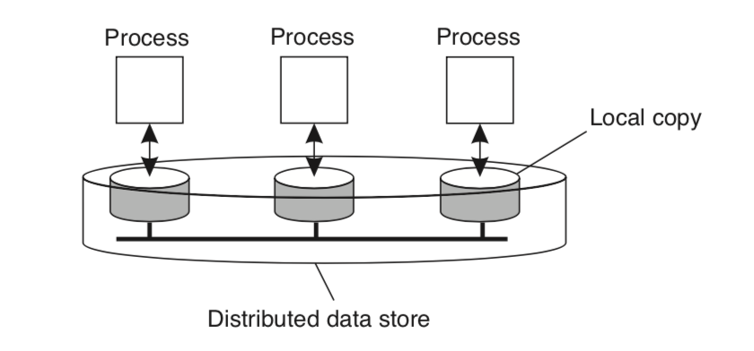
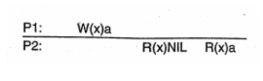
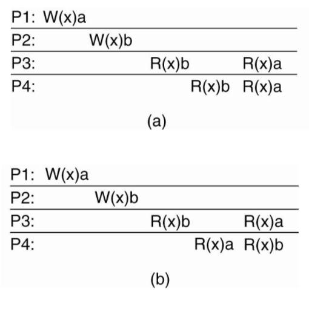
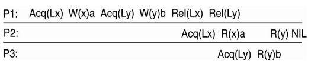
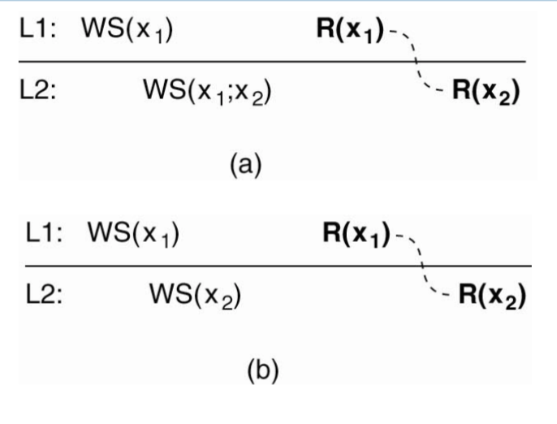
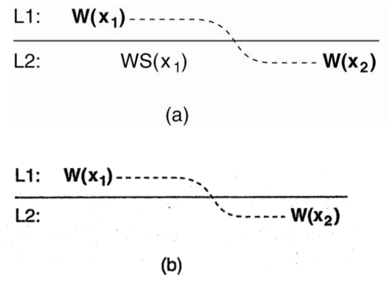
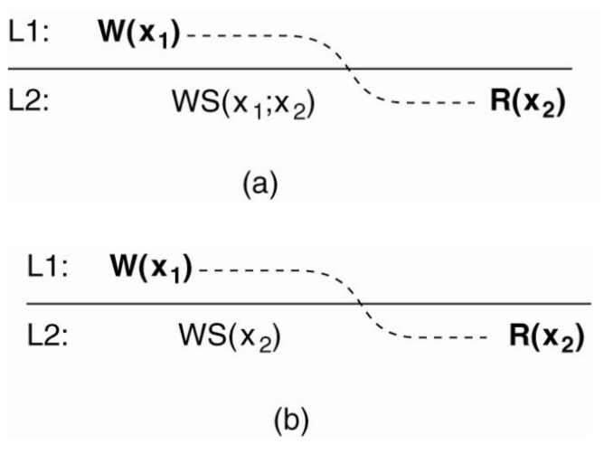
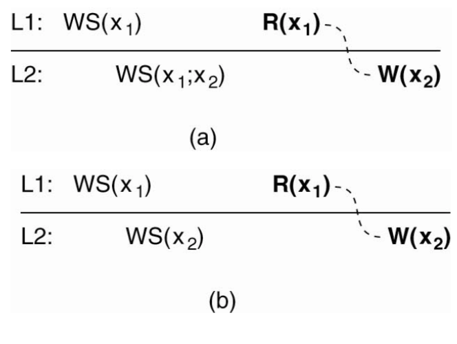

# Sao lưu và thống nhất dữ liệu phần 1

## 1. Mở đầu

### 1.1 Lý do sao lưu

Các lý do chính
* Độ tin cậy: tăng tính sẵn sàng của hệ thống (nếu có bản sao bị treo -> chuyển sang bản sao khác)
* Hiệu năng: người dùng có thể lựa chọn các bản sao gần nhất (theo vị trí địa lý) để yêu cầu dịch vụ -> chi phí kết nối của hệ thống rẻ nhất có thể
* Khả năng co giãn: hệ thống có thể phân tải cho các bản sao để tăng khả năng phục vụ cho hệ thống. Tuy nhiên, khó đánh giá khả năng co giãn do việc phân tải cho các bản sao đòi hỏi mất thời gian và đầu tư cho thuật toán để thực hiện việc đó

Ví dụ: sao lưu server, sao lưu giữa các client... Yêu cầu đặt ra là dữ liệu phải giống nhau giữa các bản sao, từ đó ta có yêu cầu về tính thống nhất đối với các bản sao trong hệ thống

### 1.2 Tính thống nhất

Yêu cầu là các bản sao cần có một dữ liệu. Tuy nhiên, vấn đề đặt ra là hệ thống không thể cùng lúc đồng bộ hoá dữ liệu giữa các bản sao -> Làm như thế nào? Khi nào? Ta có hai loại tính thống nhất:
- Tính thống nhất yếu (lỏng): không yêu cầu dữ liệu phải thống nhất với nhau ở tất cả các bản sao sau khi cập nhật
- Tính thống nhất mạnh (chặt): có yêu cầu điều đó. Tuy nhiên để đạt được thì phải đánh đổi yêu cầu hiệu năng

Ví dụ: sử dụng bộ nhớ đệm của trình duyệt web. Để đảm bảo tính thống nhất, có 2 cách
- Cấm không cho dùng bộ nhớ đệm: không hay
- Server cập nhật bộ nhớ đệm khi có nội dung thay đổi -> chọn mô hình thống nhất hợp lý

Ưu và nhược điểm của sao lưu
* Ưu
  - cải thiện hiệu năng về thời gian
  - đảm bảo tính co giãn của hệ thống
  - giảm băng thông sử dụng
* Nhược
  - đảm báo tính thống nhất chặt dẫn đến tốn băng thông
  - tuỳ thuộc vào yêu cầu của người dùng

## 2. Mô hình thống nhất hướng dữ liệu

### 2.1 Kho dữ liệu
#### Khái niệm

* là mô hình bộ nhớ chia sẻ dùng chung bao gồm các thao tác đọc, ghi, phân vùng bộ
* các tiến trình có các bản sao cục bộ của kho dữ liệu: là tập hợp các bản sao cục bộ tạo thành kho dữ liệu
* các thao tác trên kho dữ liệu bao gồm:
  - đọc dữ liệu: không làm thay đổi dữ liệu
  - ghi dữ liệu: có thay đổi dữ liệu
* mô hình thống nhất: đặc tả khả năng đáp ứng của kho dữ liệu phân tán về tính thống nhất, bao gồm thoả thuận ràng buộc giữa tiến trình và kho dữ liệu. Ở đây, tiến trình sử dụng dữ liệu trong kho dữ liệu, kho dữ liệu đảm bảo cung cấp dữ liệu một cách thống nhất theo mô hình thống nhất. Ví dụ: khi tiến trình đọc dữ liệu, dữ liệu trả về luôn luôn là của thao tác ghi cuối cùng (-> thao tác ghi nào là cuối cùng?). Cần phải giới hạn các giá trị trả về, nếu giới hạn nhiều thì dễ thực hiện hơn, giới hạn ít thì khó thực hiện hơn.

#### Yêu cầu của mô hình thống nhất
Mức độ thống nhất mà kho dữ liệu yêu cầu khi tiến trình đọc, dữ liệu trả về luôn luôn là dữ liệu của thao tác ghi cuối cùng. Vậy thao tác ghi cuối cùng là thế nào? 

Nếu mức độ lỏng
- thì xử lý cục bộ
- ràng buộc thao tác nhiều và dễ thực hiện

Nếu mức độ chặt
- thì xử lý toàn cục
- ràng buộc thao tác ít và khó thực hiện

Ngoài ra yêu cầu còn liên quan đến thoả thuận mà kho dữ liệu cung cấp cho tiến trình. 

### 2.2 Mô hình thống nhất liên tục
Dựa trên giá trị dữ liệu và các thông số trên bản ghi cục bộ để xác định mức độ thống nhất, các giá trị này có thể là:
- chênh lệch giá trị của dữ liệu
- chênh lệch thời gian cập nhật của các bản sao cục bộ không vượt quá giá trị thoả thuận
- chênh lệch sai khác giữa các thứ tự thực hiện trên các bản sao khác nhau không vượt quá giá trị thoả thuận

Khi độ lệch vượt quá giá trị cho trước thì middleware sẽ cập nhật các giá trị cho phù hợp. 
- Với giá trị sai khác thì sẽ cập nhật giá trị cho trước. 
- Với thời gian cập nhật sai khác quá lớn, thì cập nhật lại giá trị mới. 
- Nếu thứ tự thực hiện sai khác quá nhiều thì sẽ thực hiện rollback và thực hiện lại đúng với thứ tự cần thiết

Conit
* dùng để định nghĩa độ không thống nhất, từ đó để đánh giá độ thống nhất. Cụ thể Conit được coi như tập dữ liệu của kho dữ liệu phân tán. 
* Mức độ thống nhất được xác định theo nhiều mức độ khác nhau
  - Về số lượng các thao tác đã được thực hiện nhưng chưa hoàn thành với số lượng các thao tác chưa được thực hiện trên phần tử dữ liệu
  - Về sai khác của dữ liệu sẽ hoàn thành với dữ liệu đã hoàn thành
* Kích thước Conit
  - lớn -> tăng số lần cập nhật, nhỏ -> giảm số lần cập nhật
  - cần được lựa chọn khi cài đặt
    - nếu số lượng conit ít, kích thước conit lớn -> khả năng xuất hiện sai lệch cao -> chi phí cao -> không hiệu quả với các dữ liệu độc lập. Ví dụ: sau khi có thao tác cập nhật thứ hai thì cần phải tiếp tục cập nhật bản sao 2
    - nếu số lượng conit nhiều, kích thước conit nhỏ -> giảm khả năng xuất hiến ai lệch, chi phí quản lý các bản sao lớn

### 2.3 Mô hình thống nhất theo thứ tự thao tác
Mục tiêu: đạt được thống nhất giữa các dữ liệu chia sẻ. Cụ thể là các dữ liệu được sao lưu (có thể là dữ liệu tập trung, phân tán). Khi thực hiện thao tác, các bản sao phải thống nhất với nhau về một thứ tự thực hiện, vậy sẽ dẫn đến thống nhất với nhau về dữ liệu. Đây được coi là mở rộng của mô hình thống nhất liên tục.

#### Ký hiệu

Với các quá trình thực hiện khác nhau, các tiến trình luôn luôn cho một kết quả. Các thao tác trên dữ liệu bao gồm
- Đọc ký hiệu: `R(x)b`
- Ghi ký hiệu: `W(x)a`
- Giá trị khởi tạo của dữ liệu là `nil`

Trong ví dụ, tiến trình P1 thực hiện thao tác ghi a vào x, ký hiệu là W(x)a, thao tác này được cập nhật trên bản sao cục bộ của tiến trình P1. Sau đó được phổ biến tới tiến trình P2. Tiến trình P2 đọc được dữ liệu NIL kể cả sau khi P1 đã ghi vì cần có thời gian để thay đổi được cập nhật đến P2, sau đó tiến trình P2 đọc dữ liệu R(x)a. Thao tác ghi được tất cả các tiến trình nhìn thấy theo cùng một thứ tự.

#### Mô hình thống nhất tuần tự

Các tiến trình Pi có chuỗi thực hiện các thao tác Ci trên một phần tử dữ liệu. Các thao tác này khi thực hiện sẽ được kho dữ liệu tập hợp lại và thực hiện thành chuỗi Cj. Nếu tất cả các Ci thuộc Cj thì sẽ thoả mãn tính chất tuần tự, nếu không thì không thoả mãn tính chất thống nhất tuần tự

Xét ví dụ,
Ở hình a, P1 ghi giá trị a, P2 ghi giá trị b, P3 và P4 đều đọc được giá trị b trước giá trị a. Nếu xét về thứ tự thì thứ tự cục bộ sẽ là R(x)b R(x)a, thứ tự toàn cục là W(x)b - R(x)b, W(x)a - R(x)a. Phải có thủ tục đợi trên P1 để P3, P4 cập nhật b trước. Nếu thứ tự thực hiện giữ nguyên thì kết quả sẽ không thay đổi.
Ở hình b, không thể tìm được thứ tự thực hiện để P3 và P4 bảo toàn. Có các thứ tự thực hiện khác nhau do thao tác ghi khác nhau ở P1 và P2. Trường hợp này không đảm bảo thứ tự thực hiện giống nhau -> không đảm bảo thống nhất tuần tự.

#### Mô hình thống nhất nhân quả

Để đạt được, cần tuân theo các nguyên tắc sau:
- Các thao tác ghi có quan hệ nhân quả được thực hiện cùng thứ tự
- Các thao tác ghi song song/ tương tranh thì không bắt buộc phải thực hiện theo cùng thứ tự

Xét ví dụ,
Ở hình a, vì có thao tác ghi R(x)a trên P2 trước khi W(x)b nên có thể coi W(x)a có quan hệ nhân quả với W(x)b. Tuy nhiên thứ tự đọc ở P3 và P4 lại khác nhau. Vì vậy không thoả mãn nhân quả
Ở hình b, không còn thao tác ghi R(x)a trên P2 nữa nên hai thao tác W(x)a và W(x)b được coi là tương tranh. Mô hình này thoả mãn thống nhất nhân quả những không thống nhất tuần tự.

> Vì vậy, người ta nói thống nhất nhân quả yếu hơn thống nhất tuần tự

#### Giao thức nhóm

Thống nhất nhân quả và tuần tự là sản phẩm của bộ nhớ chia sẻ dùng chung nên phù hợp với các quan hệ điểm - điểm, buộc lập trình viên thiết kế các giao thức -> phức tạp. Trong một số trường hợp, dữ liệu cần được quảng bá một lần cho tất cả các bản sao, từ đó ta phải sử dụng các thao tác nhóm. Một trong những giao thức được sử dụng rộng rãi là _đoạn găng_.

Nguyên tắc:
- Chỉ được truy cập đoạn găng khi tất cả thao tác cập nhật đã hoàn thành
- Chỉ được truy cập đoạn găng để ghi khi không có tiến trình nào giữ quyền truy cập
- Trước khi truy cập đoạn găng để đọc, cần kiểm tra với chủ đoạn găng về tính cập nhật dữ liệu

Xét ví dụ: (Acq - truy cập vào, Rel - giải phóng giá trị)

#### Phân biệt tính thống nhất và phù hợp

Thống nhất | Phù hợp
--- | ---
đảm bảo việc khi ở những nơi khác nhau, các tiến trình khác nhau sẽ được nhìn thấy theo một thứ tự có ý nghĩa | đảm bảo một giá trị được viết bởi một tiến trình sẽ được nhìn thấy bởi tiến trình khác nhưng không đảm bảo khi nào

## 3. Mô hình thống nhất hướng người dùng

Mục tiêu: đảm bảo các tiến trình sử dụng dữ liệu có khung nhìn thống nhất về dữ liệu

### 3.1 Thống nhất trong thời gian dài

Đặc trưng
- Tương đương với việc tạm thời chưa thống nhất trong khoảng thời gian đó
- Chi phí hệ thống rẻ
- Chất lượng dịch vụ thấp, đặc biệt là dịch vụ thời gian thực

Ví dụ
- các ứng dụng Database chủ yếu đọc, rất ít khi cập nhật
- DNS chủ yếu đọc, ít khi cập nhật
- WebCache chỉ đọc, không cập nhật

Xung đột ghi - ghi gần như không xảy ra. Xung đột đọc - ghi -> tiến trình khách khi đọc sẽ có các giá trị khác nhau của dữ liệu, nếu dữ liệu không bị thay đổi trong thời gian đủ dài thì mô hình này sẽ đạt được sự thống nhất.

Nếu tiến trình khách luôn luôn truy cập vào một bản sao đẫn đến thống nhất luôn được đảm bảo. Nếu tiến trình khách truy cập vào các bản sao khác nhau thì có vấn đề.

Kiểu thống nhất này không quan tâm đến những bản sao khác cũng như không quan tâm tới các tiến trình khách khác.

Ký hiệu
- kho dữ liệu phân tán
- tiến trình truy cập vào bản sao cục bộ
- chỉ có một tiến trình được cập nhật dữ liệu
- `xi[t]` là dữ liệu x, tiến trình i, thời gian t - là kết quả của các thao tác ghi `WS(xi[t])`

### 3.2 Thống nhất đơn điệu đọc
Nếu một tiến trình đọc dữ liệu x, tất cả các thao tác tiếp theo của tiến trình đó đọc cùng một giá trị hoặc giá trị mới hơn của x. Nếu tiến trình x đã đọc được giá trị x, không bao giờ đọc giá trị cũ hơn x.

Ví dụ: nhận Email. Nếu nhận email ở vị trí A, khi sang vị trí B vẫn phải nhận được.

Ở hình a, `WS(x1;x2)` đảm bảo đã đọc ghi x1 trước x2. Ở hình b không đảm bảo việc này.

### 3.3 Thống nhất đơn điệu ghi

Đặc trưng
- Các thao tác ghi của một tiến trình trên dữ liệu x là rời nhau (tương tự như FIFO). 
- Các thao tác ghi của một tiến trình cần được kết thúc trước khi có thêm bất cứ thao tác ghi nào của một tiến trình trên một phần tử dữ liệu. 
- Các thao tác ghi cần chờ các thao ghi trước kết thúc.

Ví dụ: đảm bảo cập nhật phiên bản mới nhất của phần mềm từ nhà phát triển

Ở hình a, thao tác ghi đã được cập nhật với L2, nên thoả mãn. Còn ở hình b thì không.

### 3.4 Thống nhất thao tác đọc dữ liệu ghi

Trên một tiến trình, nếu thao tác đọc xảy ra sau thao tác ghi -> thao tác đọc sẽ xảy ra sau khi thao tác ghi hoàn thành, các thao tác đọc sẽ chờ cho tới khi thao tác ghi hoàn thành mới thực hiện. Ví dụ như cập nhật trang web, đọc nội dung trang web hoặc cập nhật mật khẩu.

Ở hình a, thao tác ghi dữ liệu x1 đã được cập nhật. Còn ở hình 2 thì không.

### 3.5 Thống nhất ghi sau khi đọc

Thao tác ghi thực hiện sau thao tác đọc -> thao tác ghi chỉ được thực hiện sau khi thao tác đọc hoàn thành. Ví dụ chỉ có thể trả lời sau khi đã đọc xong email (thư đã ở trong bản sao cục bộ của dữ liệu nên có thể trả lời).

Ở hình a, tiến trình thực hiện đọc bản sao x1 ở L1 trước khi ghi x2 ở bản sao L2. Ta thấy việc ghi x1 đã được cập nhật đến L2 trước khi tiến trình đó ghi x2 -> thoả mãn. Mô hình 2 thì không.