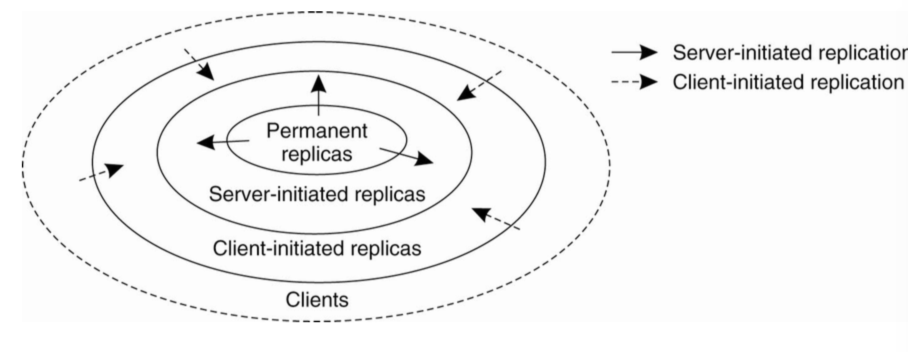
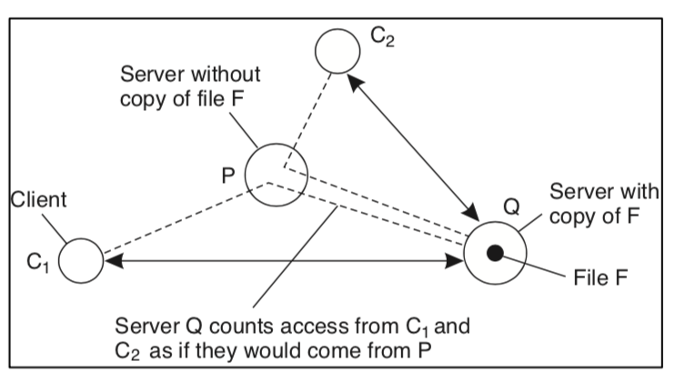
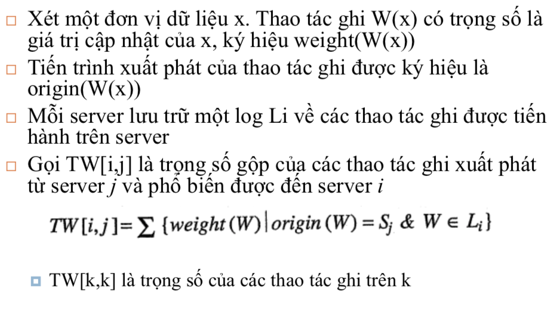
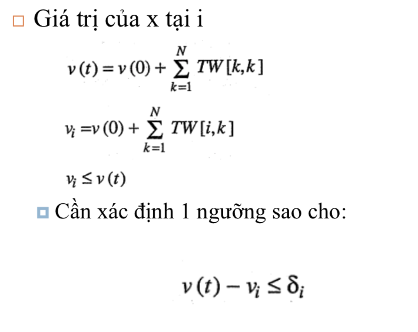
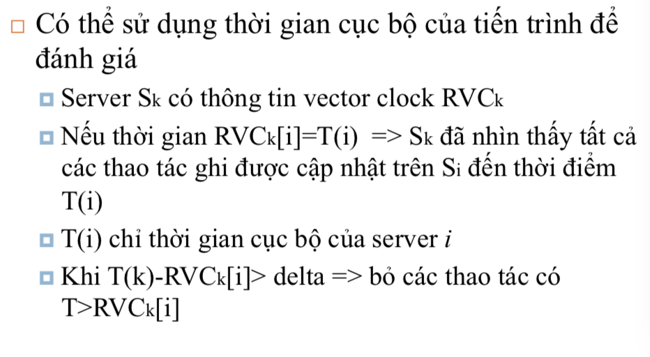
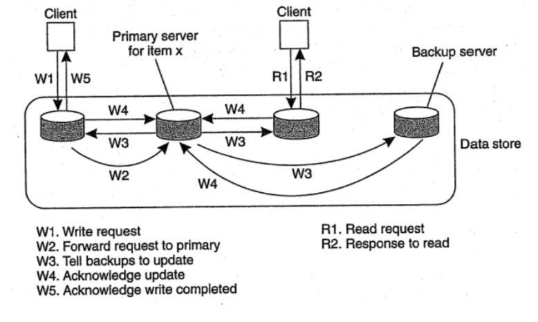
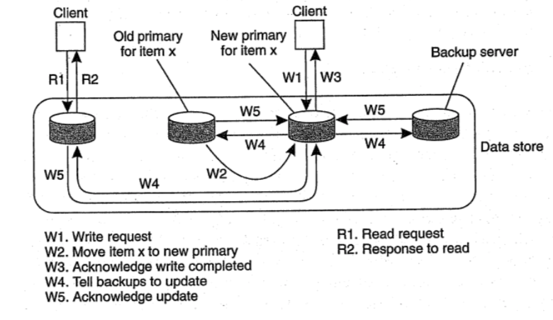

# Sao lưu và thống nhất dữ liệu phần 2

## 1. Quản lý sao lưu

### 1.1 Đặt máy chủ sao lưu ở đâu?

Mô tả bài toán:
- Cho trước vị trí N máy chủ
- Xác định K trong N vị trí tối ưu để đặt các bản sao

Giải pháp
* Giải pháp 1: Dựa vào khoảng cách giữa các client -> giảm tối đa khoảng cách trung bình giữa các bản sao và client. Sau khi đã lựa chọn K - 1 bản sao, sẽ xác định bản sao thứ K để khoảng cách trung bình từ bản sao đến các client là nhỏ nhất. Khoảng cách có thể đo bằng thời gian hoặc các tiêu chí khác
* Giải pháp 2: 
    - Không phụ thuộc vào vị trí client. Hệ thống sẽ chi thành các cell hay là hệ tự trị (Autonomous System), sau đó giải thuật sẽ chọn hệ tự trị lớn nhất và đặt server ở vị trí có nhiều link nhất. Tiếp tục lần lượt đặt server vào các hệ tự trị nhỏ hơn cho đến hết server.
    - Xác định kích cỡ của các cell: chia mạng thành các vùng, các node trong mạng cùng truy cập vào một vùng nội dung thông tin và chúng có độ trễ trao đổi thông tin thấp. Tiếp đến là chọn vùng có nhiều node nhất để đặt server và tiếp tục cho đến khi hết server. Nếu số lượng cell nhiều -> số lượng bản sao nhiều. Nếu số lượng cell ít thì ngược lại. Việc chia vùng được thực hiện là chia mạng thành các ô (các cell) và kết hợp với các cell thành vùng. Số lượng cell ở đây sẽ phụ thuộc vào số lượng các bản sao cần thiết và độ trễ giữa các cell

### 1.2 Đặt bản sao nội dung ở đâu?

Việc tổ chức lưu trữ bản sao nội dung có thể tổ chức như hình vẽ:
* Các bản sao cố định (Permanent Replica): ví dụ áp dụng cho mô hình các website, nội dung dữ liệu sẽ được sao lưu vào các bản sao. 
    - Kiểu thứ nhất là khi có yêu cầu gửi đến thì chuyển tiếp yêu cầu đó đến một trong các bản sao đó. 
    - Kiểu thứ hai là kiểu Mirroring, một client sẽ được chọn một danh sách các mirror site
* Các bản sao do server điều khiển (Server-initialized Replica)
* Các bản sao do client diều khiển (Client-initialized Replica)

#### Các bản sao cố định (Permanent Replica)
* Là các bản sao tồn tại khi khởi động kho dữ liệu. Số lượng các bản sao cố định là nhỏ.
* Cách tổ chức
    - Dữ liệu được sao lưu trên các bản sao khác nhau. Khi có yêu cầu sử dụng dữ liệu, thì yêu cầu sẽ được chuyển đến một bản sao theo giải thuật round-robin
    - Mirroring: các client chọn một trong các bản sao để truy cập, client sẽ kết nối với từng bản sao và xác định xem bản sao nào có thông tin phù hợp để truy cập. Ví dụ dùng cho web hoặc cơ sở dữ liệu
* Nguyên tắc chung: không chia sẻ tài nguyên giữa các bản sao

#### Các bản sao do server điều khiển (Server-initialized Replica)
Được kích hoạt bằng server. Khi server đang hoạt động, nó sẽ kích hoạt các bản sao ở vị trí khác phụ thuộc theo yêu cầu -> giảm tải cho các bản sao cũ và cập nhật dữ liệu trên bản sao mới gần với client hơn.

Mỗi server theo dõi truy cập vào từng phần tử dữ liệu, cho trước một tiến trình khách C, có thể xác định được tiến trình gần C nhất. Như ví dụ nếu C1 và C2 có cùng một server gần nhất là P. Mọi truy cập từ C1 và C2 coi là xuất phát từ P. Xét 3 trường hợp:
- khi truy cập vào phần tử dữ liệu F xuống dưới delF -> phần tử đó sẽ được xoá khỏi Q -> số lượng bản sao giảm xuống -> tăng tải cho server khác => cần có cơ chế đảm bảo tồn tại một bản sao của các phần tử dữ liệu
- khi số lượng truy cập vượt quá refF -> server sẽ tạo các bản sao mới trên các server khác
- số lượng yêu cầu nằm giữa khoảng del - ref -> giữ nguyên số lượng các bản sao
- nếu số lượng truy cập vào P > Q thì chuyển bản sao đến Q và ngược lại

#### Các bản sao do client diều khiển (Client-initialized Replica)

Chủ yếu ở việc quản lý bộ đệm (Cache). Client quyết định cập nhật Cache bao gồm 2 thao tác là xoá và ghi. Client phải quyết định chính sách Cache cho riêng mình. Ngoài ra có thể chia sẻ Cache giữa các client với nhau.

Để thực hiện phân phối nội dung, thì cần thực hiện cân bằng:
- State (trạng thái) và Operation (thao tác)
- Pull và Push
- Unicast và Multicast

##### State vs Operation

Có 3 giải pháp để cập nhật dữ liệu:
- Chỉ thông báo khi có cập nhật: tức là giảm thông tin cần truyền, sử dụng các thông báo vô hiệu hoá dữ liệu; các bản sao nhận được thông báo vô hiệu hoá dữ liệu sẽ loại bỏ dữ liệu và khi có nhu cầu sẽ tải dữ liệu về. Chỉ thích hợp cho trường hợp ghi nhiều - đọc ít. Ưu điểm: sử dụng ít băng thông mạng
- Truyền dữ liệu cập nhật: giảm thông tin cần truyền, thích hợp đọc nhiều - ghi ít
- Truyền thao tác cập nhật: các bản sao theo dõi trạng thái của dữ liệu và chỉ truyền tham số cần thiết cho thao tác cập nhật

##### Pull vs Push

Với Pull: 
- Client chịu trách nhiệm cập nhật. Khi có nhu cầu cập nhật -> client thông báo lên cho server => client không biết khi nào thông tin trên server cập nhật để gửi yêu cầu. Nếu thực hiện Pulling thì rất nguy hại chi phí.
- Việc thực hiện Pull tuỳ theo yêu cầu của hệ thống -> quản lý phức tạp

Với Push:
- Server điều khiển khi nào sẽ cập nhật dữ liệu trên client -> server phải lưu trữ thông tin về client và các replica
- Thích hợp với các thao tác chủ yếu là cập nhật. Tuy nhiên có nhiều thao tác cập nhật vô nghĩa khi client không đọc

Kết hợp Pull và Push, mỗi thành phần thông tin có thông số thời gian cần thiết để cập nhật. Nếu server không vượt qua thời gian cần thiết thì không cần cập nhật, nếu quá thì cập nhật. Server có thể điều chỉnh thời gian cập nhật này. Nếu băng thông lớn, tải CPU nhỏ -> giảm thời gian cần thiết & ngược lại

##### Unicast vs Multicast

Với Multicast
- chi phí thấp hơn sẽ phù hợp với một số hạ tầng mạng
- nếu kết hợp multicast và push thì chi phí push = 0

Với Unicast: thông báo gửi theo kênh điểm - điểm đến tất cả các đích, thích hợp cho mạng diện rộng

## 2. Giao thức thống nhất

### 2.1 Thống nhất liên tục

#### Thống nhất về giới hạn sai lệch giá trị

#### Thống nhất về giới hạn sai lệch thời gian

#### Thống nhất về giới hạn sai lệch thao tác
Các thao tác được đưa vào hàng đợi -> sai lệch giá trị lớn nhất của hàng đợi và trật tự các thao tác

### 2.2 Giao thức dựa vào bản sao đầu tiên (primary)

Mỗi phần tử dữ liệu có một bản sao gọi là primary, chịu trách nhiệm điều khiển các thao tác trên phần tử đó. Từ đó chia ra làm:
- Fixed primary (primary cố định)
- Dynamic primary (primary động)

#### Giao thức ghi từ xa (remote-write protocol) (fixed)

Cơ chế hoạt động:
- Tất cả thao tác ghi được chuyển đến cho 1 server
- Thao tác đọc có thể thực hiện cục bộ

Đặc điểm:
- Thời gian cập nhật chậm
- Đảm bảo thống nhất tuần tự

Ví dụ trên hình vẽ: Khi client muốn ghi -> gửi thao tác ghi lên bản sao cục bộ -> chuyển tiếp lên primary -> primary quảng bá cho mọi bản sao -> mọi bản sao trả về thông báo nhận -> trả về thông báo ghi cho client. Từ đó mỗi khi muốn đọc -> chỉ cần đọc trên bản sao cục bộ của mình.

#### Giao thức ghi cục bộ (local-write protocol) (dynamic)

Cơ chế hoạt động:
- Khi cần cập nhật, xác định vị trí của primary
- Chuyển primary về cục bộ, cập nhật dữ liệu

Cụ thể trong hình: client gửi yêu cầu cập nhật đến cho bản sao cục bộ của mình. Lúc đó, primary sẽ chuyển phần tử đó về cho bản sao cục bộ và coi đó như là primary mới của phần tử đó. Tiếp tới, thực hiện quảng bá việc cập nhật cho các bản sao khác. Sau đó, khi có bất kỳ client nào khác muốn đọc nội dung của phần tử đó -> chỉ đọc nội dung trên bản sao cục bộ của mình.

Kết hợp hai mô hình trên: 1 server tiếp nhận, server cho phép các server khác tạm thời thành primary cho các phần tử dữ liệu.

### 2.3 Giao thức ghi trên các bản sao
* Giao thức ghi có thể thực hiện trên nhiều máy cùng lúc
* Với kiểu sao lưu tích cực
    - một tiến trình chịu trách nhiệm phổ biến thao tác cập nhật đến tất cả các bản sao
    - cần có cơ chế trật tự toàn cục (có thể sử dụng thời gian logic của Lamport, tuy nhiên, sẽ không co giãn được, hoặc sequence)
* Với sao lưu theo vote (giải thuật Quorum)
    - muốn thống nhất mạnh thì phải cập nhật tất cả bản sao
    - sau khi cập nhật với chi phí tốn kém thì không phải tất cả bản sao đều được đọc -> chi phí vô ích

Xét giải thuật Quorum, hai điều kiện cần thoả mãn là
* Nr + Nw > N -> tránh xung đột đọc-ghi => đọc được giá trị mới nhất
* Nw > N/2 -> tránh xung đột ghi-ghi

### 2.4 Giao thức đảm bảo sự phù hợp của bộ nhớ đệm (Cache)
* Caching là trường hợp đặc biệt của sao lưu
* Các giao thức Caching -> sự phù hợp của nội dung Cache
    - Chính sách phát hiện sai khác
        - tĩnh: kiểm tra dữ liệu trước khi thực hiện
        - động: kiểm tra dữ liệu khi đang thực hiện. Có thể thực hiện trước khi tiến hành thao tác -> đảm bảo có đủ dữ liệu. Có thể thực hiện trong khi tiến hành thao tác hoặc khi thao tác đã tiến hành xong
    - Muốn đảm bảo thống nhất giữa cache và server thì có 3 cách thức: không cache, luôn luôn cache, kết hợp
    - Sử dụng thông điệp không hợp lệ