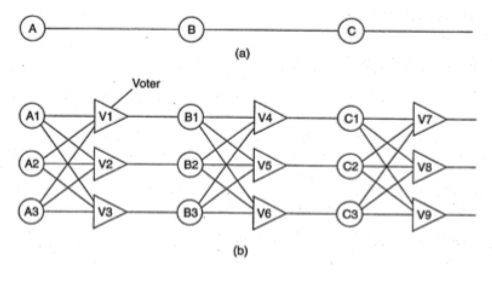
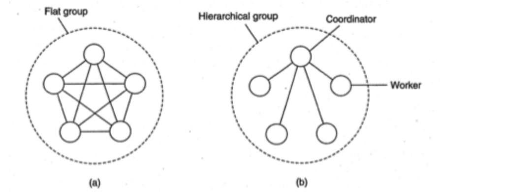

# Topic 13 - Tính chịu lỗi trong hệ phân tán

## 1. Mở đầu

### 1.1 Khái niệm cơ bản
Khả năng chịu lỗi liên quan đến **hệ thống đáng tin cậy**, bao gồm
- Tính sẵn sàng: sẵn sàng để sử dụng ngay lập tức
- Tính tin cậy: hệ thống chạy liên tục trong khi gặp lỗi
- Tính an toàn: không có thảm hoạ xảy ra
- Tính bảo trì: dễ dàng để được sửa chữa -> lỗi có thể được phát hiện và sửa chữa tự động

Một số khái niệm
- Fall: không thể đáp ứng được những dịch vụ dự kiến đáp ứng
- Fault: nguyên nhân của lỗi
- Fault Tolerance: hệ thống có thể đáp ứng dịch vụ của mình ngay cả khi gặp lỗi.
- Transitent Fault (lỗi tạm thời): lỗi xảy ra một lần rồi biến mất
- Intermittent Fault (lỗi liên tục): lỗi xảy ra, biến mất; sau đó lại xuất hiện (ví dụ như liên lạc lỏng trên một kết nối)
- Permanent Fault (lỗi thường trú): tiếp tục tồn tại cho tới khi các thành phần bị lỗi được thay thế

### 1.2 Mô hình lỗi
Khi một hệ thống bị lỗi, là khi nó không cung ứng được đủ những dịch vụ mà nó được thiết kế để cung cấp.

Ví dụ: xét một hệ phân tán bao gồm tập hợp các server trao đổi thông tin với các client. Nếu tập các server đó không cung ứng được đủ các dịch vụ -> các server đó | các kênh trao đổi thông tin | cả hai đều bị lỗi. Tuy nhiên một server không hoạt động tốt -> chưa chắc đã có lỗi. Nếu server đó phụ thuộc vào server khác để cung ứng đầy đủ các dịch vụ thì đôi khi lỗi lại ở một nơi khác.

Bàn về các mô hình lỗi, bảng sau mô tả một số mô hình lỗi khác nhau

Loại lỗi | Mô tả
--- | ---
Crash Failure (Lỗi sụp đổ) | Một server tạm ngừng hoạt động, nhưng vẫn hoạt động chính xác cho tới khi nó ngừng hoạt động
Omission Failure (Lỗi thiếu sót) | Một server không đáp ứng được những yêu cầu được gửi đến, bao gồm _Receive Omission_ (Lỗi thiếu sót nhận) và _Send Ommission_ (Lỗi thiếu sót gửi)
Timing Failure (Lỗi về thời gian) | Thông điệp trả lời của server vượt quá khoảng thời gian cho phép
Response Failure (Lỗi về câu trả lời) | Câu trả lời của server là không chính xác
Abitrary Failure (Lỗi độc đoán) | Server sinh ra các câu trả lời một cách độc đoán vào một thời điểm độc đoán
Fall-stop Failure (Lỗi dừng) | Một server bị dừng cung ứng đầu ra nhưng việc dừng của nó được các hệ thống khác phát hiện
Fall-silent Failure (Lỗi im lặng) | Tiến trình khác kết luận một cách sai lầm rằng server đó đã dừng hoạt động

### 1.3 Cơ chế che giấu lỗi bằng dư thừa

MỘt hệ thống được coi là có tính chịu lỗi nếu nó có khả năng che giấu sự xuất hiện của lỗi đối với các tiến trình khác. Kỹ thuật quan trọng để che giấu nó là sử dụng khái niệm dư thừa. Có 3 kiểu dư thừa:
- Information redundancy (Thông tin dư thừa): là một số bit được thêm vào để cho phép phục hồi từ các bit bị mất
- Time redundancy (Thời gian dư thừa): là thực hiện một thao tác và sau đó cần thiết thì thực hiện lại thao tác đó
- Physical redundancy (Dư thừa vật chất): các thiết bị/ các tiến trình được thêm vào để hệ thống có khả năng chịu được sự mất mát hoặc hoạt động sai của một số bộ phận.

Để hiểu được dư thừa vật chất, xét ví dụ trên hình vẽ

Ở hình a, tín hiệu được truyền qua 3 thiết bị A, B, C. Nếu một trong số chúng bị lỗi thì tín hiệu cuối cùng sẽ bị lỗi. Để giải quyết vấn đề này, người ta sử dụng mô hình Triple Modular Redundancy (TMR), mỗi thiết bị sẽ được thay thế 3 lần: với mỗi đầu vào thêm vào 3 voter. Chẳng hạn nếu đầu vào A2 bị lỗi thì các voter V1 và V3 vẫn nhận giá trị tương đương nên đầu ra vẫn nhận được giá trị đúng.

## 2. Khả năng phục hồi của tiến trình

### 2.1 Các vấn đề thiết kế

#### Hướng tiếp cận phân nhóm

Để xem xét các vấn đề về thiết kế, chúng ta sẽ khảo sát các nhóm tiến trình.
- Hướng tiếp cận là tổ chức các tiến trình giống nhau vào một nhóm. 
- Đặc điểm chính mà tất cả các nhóm đều có là khi một thông điệp được gửi cho nhóm thì tất cả các thành viên của nhóm đó đều nhận được. Tức là nếu một tiến trình bị lỗi thì các tiến trình khác đều nhận được
- Nhóm tiến trình rất cơ động: các nhóm mới có thể được tạo thêm và các nhóm cũ có thể bị huỷ đi. Một tiến trình có thể tham gia một nhóm hoặc rời một nhóm trong lúc tiến trình đang hoạt động

Để phân biệt các nhóm, hãy xem cấu trúc bên trong của chúng. 
- Flat Group (nhóm phẳng): các tiến trình đều ngang hàng, không ai làm chủ (hình a)
- Hierachical Group (nhóm phân cấp): có kiến trúc phân cấp. Ví dụ một tiến trình là `coordinator`, các tiến trình khác là thành viên (hình b)

Mỗi kiểu nhóm có ưu và nhược điểm như mô tả trong bảng:
**Với kiểu nhóm phẳng**
Ưu điểm | Nhược điểm
--- | ---
Cân bằng, không có điểm lỗi đơn, nếu một tiến trình hỏng thì nhóm chỉ bị nhỏ bớt đi chứ vẫn hoạt động bình thường | Việc ra quyết định rất phức tạp

**Với kiểu nhóm phẳng thì ưu/ nhược điểm ngược lại**

#### Hướng tiếp cận Group Server

Khi tồn tại việc trao đổi thông tin nhóm, một vài phương thức cần thiết để tạo & xoá nhóm, cũng như cho phép các tiến trình gia nhập hoặt rời nhóm --> Hướng tiếp cận khả thi là cần có một _Group Server_
* Ưu điểm: các yêu cầu sẽ được gửi đến cho GS, GS sẽ quản lý cơ sở dữ liệu của cả nhóm
* Nhược điểm: một điểm lỗi đơn. Tức là khi GS bị hỏng hoặc dừng hoạt động thì hoạt động của cả nhóm sẽ bị dừng

#### Hướng tiếp cận hệ phân tán

Ưu điểm
- Mỗi thành viên giao tiếp trực tiếp với tất cả các thành viên khác của nhóm

Nhược điểm 
- Lỗi dừng: khi một tiến trình thành viên muốn rời nhóm thì quảng bá thông báo với thành viên khác trong cả nhóm. Trong ngữ cảnh của khả năng chịu lỗi, lỗi dừng này không phù hợp.
- Việc rời và gia nhập nhóm cần đồng bộ hoá với các thông điệp dữ liệu được gửi. Ví dụ, khi một thành viên gia nhập nhóm, nó phải nhận được các thông điệp như khi các thành viên khác gia nhập nhóm; và khi rời nhóm, nó phải không nhận được các thông từ nhóm đó nữa

#### Vấn đề khác

Khi có quá nhiều máy bị hỏng, nhóm đó không thể hoạt động được nữa thì cần thiết kế một vài giao thức để hoạt động lại nhóm.

### 2.1 Che giấu lỗi và thực hiện sao lưu

Chúng ta có thể che giấu lỗi và thực hiện sao lưu bằng cách tổ chức chúng vào nhóm (vì nhóm giúp nâng cao tính trong suốt). Có hai cách để thực hiện sao lưu:
- Sử dụng giao thức dựa trên primary
- Sử dụng các phương thức ghi sao lưu

#### Giao thức dựa trên Primary

Đặc trưng
- Sử dụng phương thức dạng bản sao primary
- Tổ chức nhóm theo kiểu phân cấp, trong đó primary sẽ điều phối cả thao tác ghi
- Khi coordinator bị hỏng, các bản sao sẽ sử dụng giải thuật bầu chọn để chọn ra primary mời

#### Giao thức ghi sao lưu

Đặc trưng
- Sử dụng giao thức dựa trên sao lưu động (cũng như sử dụng với giao thức dựa trên định số tối thiểu - `quorum`)
- Tổ chức tâp hợp các tiến trình giống nhau vào một nhóm phẳng
- Một hệ thống có khả năng chịu k lỗi nếu nó có thể hoạt động bình thường với k bộ phận bị hỏng. Tức là cần có `k + 1` bộ phận để cung ứng khả năng chịu k lỗi.

Ưu điểm
- không có điểm lỗi đơn

Nhược điểm 
- không thể biết chắc chắn k+1 tiến trình bị hỏng
- khi có quá nhiều yêu cầu gửi đến cùng lúc -> xảy ra hiện tượng `atomic multicast problem`

### 2.3 Sự đồng thuận của các tiến trình trong các hệ thống lỗi
Mục đích của các giải thuật phân tán là tất cả các tiến trình không hỏng thì sẽ đạt được thoả thuận về một vấn đề nào đó, qua một số thiết lập. Chúng ta có thể chia ra nhiều trường hợp:
- hệ thống đồng bộ & không đồng bộ
- độ trễ thời gian có giới hạn hay không
- thông điệp truyền đới có giới hạn hay không
- việc truyền thông sử dụng unicast hay multicast

#### Hệ thống đặc tả thuận với sự tham gia của Byzantine
Byzantine là một thành viên có tính phá đám: gửi thông tin thất thiệt -> hỏng quá trình bầu chọn. Giả sử có N tiến trình, mỗi tiến trình cung cấp một giá trị value(i) tạo ra từ vector V(i) có kích thước N. Nếu i là một tiến trình không hỏng thì V(i) = value(i)

Chi tiết giải thuật: lằng nhằng bỏ mẹ

Lamport et al chứng minh
> sự đồng thuận có thể đạt được nếu có 2k+1 tiến trình hoạt động đúng, với tổng 3k+1 tiến trình hoạt động, và k tiến trình lỗi

Fisher et al chứng minh rằng các thông điệp không được gửi đến trong khoảng thời gian giới hạn biết trước thì sẽ không có khả năng đạt được đồng thuận vì không phân biệt được tiến trình hoạt động chậm với các tiến trình hỏng

### 2.4 Phát hiện lỗi
Bản chất là các node không hỏng sẽ phải tìm cách để phát hiện ra các node hỏng. Có 2 cơ chế:
- Tiến trình chủ động: các tiến trình này sẽ gửi thông điệp _Bạn còn chạy tốt không?_ cho các thành viên khác
- Tiến trình thụ động: chờ các thông điệp đến từ các tiến trình khác

Cơ chế dựa trên timeout, tuy nhiên có các điểm yếu như sau:
- Phát hiện sai khi tìm thấy lỗi qua các mạng không đáng tin cậy. Ví dụ: nhận được thông điệp không trả lời sau một thao tác ping
- Đánh giá phát hiện lỗi thô khi chỉ không nhận được thông điệp trả lời

Thiết kế hệ thống con phát hiện lỗi như thế nào? Có thể sử dụng:
- Gossiping: mỗi node sẽ thông báo cho các node khác là mình vẫn chạy tốt 
- Probe: thăm dò tin tức của các node khác
- Trao đổi thông tin thường xuyên với các node hàng xóm: từ đó, một thành viên nếu có thông tin là cũ -> có thể node hỏng

Khả năng hệ thống con phát hiện lỗi?
- Phân biệt sự cố mạng từ các node hỏng bằng cách cho phép các node quyết định node hàng xóm của mình đã bị hỏng
- Thông báo cho các tiến trình không hỏng về phát hiện lỗi bằng phương pháp tiếp cận FUSE

## 3. Trao đổi thông tin client server tin cậy

### 3.1 Trao đổi thông tin điểm - điểm (P2P)

Được thiết lập bằng các giao thức giao vận đáng tin cậy như 
- TCP: che giấu lỗi bỏ sót bằng cách sử dụng những thông điệp báo nhận để gửi lại những thông điệp bị lỗi, việc làm này hoàn toàn trong suốt với người dùng. 
- Tuy nhiên, với lỗi sụp đổ của trao đổi thông tin thì không che giấu được, mỗi sụp đổ có thể xảy ra khi kết nối TCP bị gián đoạn đột ngột và như vậy thì không còn thông điệp nào được gửi đi nữa. Trong phần lớn các trường hợp, người dùng nhận được thông báo là kênh truyền đã bị hỏng. Cách duy nhất để che giấu lỗi là để cho hệ phân tán tự thiết lập một kết nối mới

### 3.2 Cơ chế RPC (Remote Procedure Calls)

Mục đích: che giấu đi trao đổi thông tin bằng cách che giấu các lời gọi thủ tục từ xa, làm cho chúng như các lời gọi cục bộ

Trong trường hợp có lỗi xảy ra, có 5 lớp lỗi khác nhau:
1. Người dùng không thể xác định vị trí máy chủ
2. Thông điệp yêu cầu từ máy khách đến máy chủ bị mất
3. Máy chủ bị treo sau khi nhận được yêu cầu
4. Thông điệp trả lời từ máy chủ cho khách hàng bị mất
5. Máy khách bị treo sau khi gửi một yêu cầu

#### Người dùng không thể xác định vị trí máy chủ

Ví dụ: người dùng không xác định được vị trí của máy chủ thích hợp hoặc tất cả máy chủ đang treo
Giải pháp: sinh ra Exception thông báo cho người dùng
Nhược điểm
- không phải tất cả các ngôn ngữ có khả năng sinh ra exception hoặc tín hiệu thông báo
- việc sinh ra exception sẽ làm mất tính trong suốt của hoạt động hệ thống

#### Thông điệp yêu cầu bị mất

Phát hiện bằng cách sử dụng bộ đếm thời gian
- Giờ hết hạn trước khi nhận được trả lời hoặc báo nhận -> sẽ gửi lại thông điệp
- Nếu yêu cầu bị mất thật -> server không biết và sẽ yêu cầu truyền lại hoặc truyền lại file gốc 
- Khi có nhiều thông điệp bị mất -> client từ bỏ và kết luận máy chủ bị hỏng/ không tìm thấy -> lỗi không thể xác định vị trí máy chủ
- Khi yêu cầu không bị mất -> máy chủ xác định và truyền lại

#### Máy chủ bị treo sau khi nhận được yêu cầu
Các lỗi có thể xảy ra
- Lỗi treo sau khi xử lý -> server gửi lại thông điệp báo lỗi cho client
- Lỗi treo sau khi nhận được yêu cầu -> server yêu cầu client gửi lại yêu cầu

Vấn đề khó khăn: client không phân biệt được hai lỗi trên

Giải pháp
* Với server
  - Ít nhất một lần tiếp tục cố gắng cho đến khi client nhận được
  - Tối đa một lần loại bỏ ngay lập tức và thông báo lại lỗi
  - Đúng một lần khi server bị hỏng và client không nhận được sự giúp đỡ và không hứa hẹn gì về dịch vụ tiếp theo
* Với client
  - Client quyết định không bao giờ gửi lại yêu cầu
  - Client quyết định luôn gửi lại yêu cầu
  - Client quyết định gửi lại một yêu cầu chỉ khi không có báo nhận
  - Client quyết định gửi lại một yêu cầu chỉ khi có báo nhận

Các trường hợp có thể xảy ra (với M - thông điệp, P - thông báo, C - lỗi treo)
1. MPC
2. MCP
3. PMC
4. PCM
5. CPM
6. CMP

Kết luận
- Khả năng máy chủ bị treo thay đổi bản chất của FPC và hệ thống đơn vi xử lý của hệ phân tán
- Trước đây, máy chủ hỏng cũng dẫn tới máy khách hỏng

#### Thông điệp trả lời từ máy chủ cho khách hàng bị mất
Giải pháp
- dựa trên một bộ đếm thời gian thiết lập bởi hệ điều hành của client. Khó khăn: client không chắc chắn tại sao không có câu trả lời (do bị mất hay bị chậm?)
- yêu cầu idempotent: cho phép gửi đi gửi lại nhiều lần mà không ảnh hưởng đến hoạt động của hệ thống -> khi gặp lỗi này với kiểu yêu cầu idempotent, client sẽ chủ động gửi lại yêu cầu
- phép gán số thứ tự: máy chủ sẽ theo dõi những số thứ tự vừa nhận từ client và từ chối thực hiện yêu cầu tiếp theo tương tự lần thứ hai

#### Máy khách bị treo
Giải pháp 
- kích hoạt tính toán "mồ côi" (không có tiến trình cha nào chờ kết quả đó). Khó khăn: lãng phí CPU, khoá tập tin hay treo các nguồn tệp tin giá trị, gây ra nhầm lẫn khi client khởi động lại hoặc thực hiện lại RPC