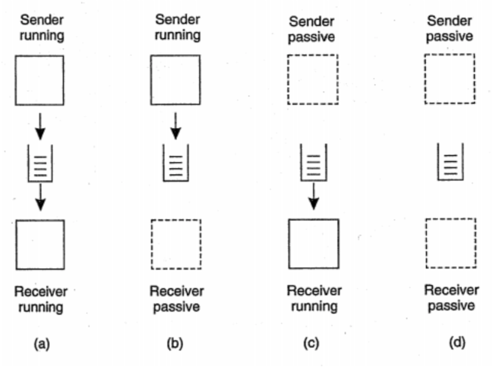
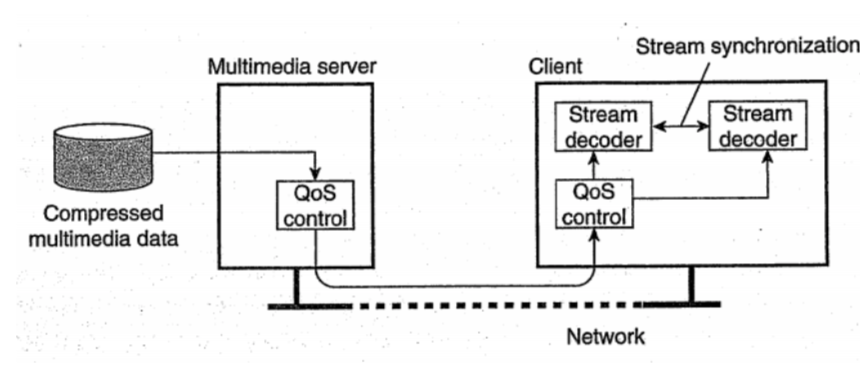
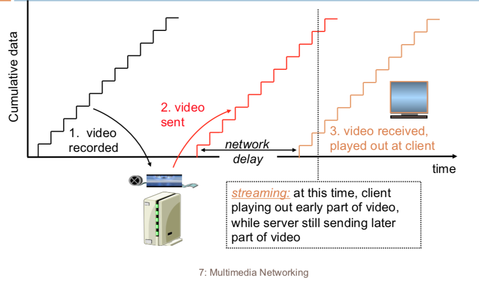

# Communication (Trao đổi thông tin) phần 2

## 1. Trao đổi thông tin hướng thông điệp

### 1.1 Hướng thông điệp tạm thời
Trao đổi bằng socket ở tầng giao vận. Việc chuẩn hoá các interface của socket ở tầng giao vận -> dev dễ dàng sử dụng giao thức hướng thông điệp đơn giản. Vì thế các interface chuẩn cho phép đặt một ứng dụng sang một máy khác. Ở đây ta thảo luận về socket trong hệ thống Berkeley Unix

Socket là điểm cuối truyền thông (communication endpoint), cho phép các ứng dụng đọc/ ghi dữ liệu. 

- Việc ghi dữ liệu tương đương với việc gửi dữ liệu qua mạng
- Việc đọc dữ liệu tương đương với việc nhận dữ liệu từ mạng

Các hàm cơ bản sử dụng (thường là 4 hàm đầu)

Hàm | Mô tả
--- | ---
socket | bên gọi sẽ tạo điểm cuối trao đổi thông tin với bên nhận qua giao thức giao vận cụ thể
bind | gắn một địa chỉ cục bộ vào một socket mới tạo được
listen | chủ yếu phục vụ các phương pháp hướng kết nối, là một lời gọi không dừng, cho phép hệ điều hành cục bộ đặt đủ dung lượng bộ đệm cho số lượng lớn các kết nối mà bên gọi sẵn sàng nhận
accept | sẽ dừng tiến trình gọi lại cho tới khi có một yêu cầu được gửi đến
connect | cần chỉ ra địa chỉ đích để gửi yêu cầu kết nối, client sẽ bị dừng đến khi nào yêu cầu kết nối được chấp nhận
send/receive | trao đổi thông tin giữa hai bên
close | kết thúc quá trình trao đổi thông tin và đóng gói kết nối

Khi một kết nối gửi đến, hệ điều hành sẽ tạo ra một socket mới với cùng tính chất với socket ban đầu và gửi trả về cho tiến trình gọi. Về phía client, đầu tiên cũng dùng hàm socket để khởi tạo socket nhưng không cần gắn socket đến một địa chỉ cục bộ, hệ điều hành sẽ tự động đảm nhận việc này.

Socket không đáp ứng được với mạng tốc độ cao & máy tính hiệu năng cao vì những lý do sau:

- Mức độ trừu tượng: chỉ có các hàm send và receive đơn giản
- Thiết kế chỉ dùng được với TCP/IP -> không phù hợp với giao thức của mạng tốc độ cao

Các mạng tốc độ cao và các máy tính hiệu năng cao sử dụng các bộ thư viện truyền thông riêng. Nó cung cấp các hàm đa dạng và hiệu quả cho việc truyền thông. Tuy nhiên các bộ thư viện đó chưa được thiết kế để phù hợp lẫn nhau -> gặp phải vấn đề về tính di động của chương trình. Sự cần thiết về độc lập giữa phần cứng và truyền thông -> chuẩn truyền thông MPI.

MPI được thiết kế cho các ứng dụng song song và truyền thông tạm thời. MPI mặc nhiên coi việc truyền thông diễn ra giữa một nhóm tiến trình, mỗi nhóm có một định danh, mỗi tiến trình có một định danh, sử dụng GROUP_ID và PROCESS_ID để định danh duy nhất tiến trình gửi và nhận thay vì sử dụng địa chỉ của tầng giao vận.

### 1.2 Hướng thông điệp bền vững

Các khối

* MOM (Message-Oriented Middleware) là lớp quan trọng của các dịch vụ middleware hướng thông điệp.
* Hệ thống hàng đợi thông điệp hỗ trợ trao đổi thông tin không bền vững và lưu trữ trung gian cho bên gửi và bên nhận khiến chúng không cần thiết phải cùng đang hoạt động lúc truyền thông điệp

Đặc điểm

* Bên gửi chỉ được đảm bảo là thông điệp đã được đưa vào hàng đợi của bên nhận mà không được đảm bảo là bên nhận đã đọc được nó hay chưa -> cơ chế cho phép trao đổi thông tin theo kiểu kết hợp lỏng theo thời gian. Bên gửi và bên nhận có thời gian hoàn toàn độc lập với nhau
* Chấp nhận độ trễ thời gian cao, lên tới vài phút thay vì chỉ vài giây như các phương pháp tạm thời

Ví dụ: hệ thống Email, bên gửi và bên nhận không cần online cùng lúc, thông điệp được gửi vào kho lưu trữ trung gian, khi một trong hai bên hoạt động sẽ lấy thông điệp từ kho về xử lý.

#### Mô hình hàng đợi thông điệp

Ý tưởng:

- các ứng dụng trao đổi thông điệp bằng cách đưa chúng vào các hàng đợi, các thông điệp đó được chuyển đi qua một chuỗi các server và đến một server đích ngay cả khi server đó bị dừng hoạt động khi thông điệp được gửi
- mỗi ứng dụng có hàng đợi riêng để cho ứng dụng khác gửi thông điệp vào. 
- một hàng đợi có thể chia sẻ cho nhiều ứng dụng cùng sử dụng 
- tiến trình gửi chỉ đảm bảo thông điệp được xếp vào hàng đợi của bên nhận chứ không biết được khi nào bên nhận sẽ đọc chúng, điều đó hoàn toàn phụ thuộc vào cơ chế và chính sách của bên nhận. 

Cơ chế liên kết lỏng: bên gửi và bên nhận chạy hoàn toàn độc lập, không phụ thuộc thời điểm gửi hay nhận.

Xét ví dụ trên hình vẽ

- Ở mô hình a, cả bên gửi và nhận đều đang hoạt động, thông điệp được gửi vào hàng đợi và liên tục được bên nhận lấy ra đọc và xử lý.
- Ở mô hình b, bên nhận không hoạt động, bên gửi vẫn tiếp tục gửi thông điệp vào hàng đợi.
- Ở mô hình c, bên gửi không hoạt động, bên nhận lấy thông điệp từ hàng đợi ra và đọc.
- Ở mô hình d, hai bên đều không hoạt động, thông điệp vẫn được lưu trữ trong hàng đợi.

#### Định địa chỉ

Tập các hàng đợi được phân tán trên nhiều máy -> cần phải duy trì một ánh xạ từ các hàng đợi đến các vị trí của mạng. Cụ thể cân phải duy trì các tên hàng đợi đến các vị trí của mạng. 

Ví dụ sử dụng DNS cho hệ thống email trên internet. Sau khi bên gửi muốn gửi đi sẽ đến một tầng chức năng chuyên để xử lý xếp hàng đợi, nó sẽ tìm trong csdl vị trí của mạng hay địa chỉ, nút giao vận (cụ thể là địa chỉ IP của bên nhận). Sau đó, thông điệp được truyền đi trong mạng đến bên nhận thì thông điệp đi qua một tầng quản lý hàng đợi và thông điệp sẽ được xếp hàng vào hàng đợi

#### Hệ thống hàng đợi thông điệp với các router

Trong hệ thống hàng đợi thông điệp, cần có các đơn vị quản lý hàng đợi (queue manager). Quản lý hàng đợi tương tác trực tiếp với ứng dụng qua việc gửi nhận thông điệp. TUy nhiên có một vài đơn vị quản lý hoạt động như một router, nó chuyển tiếp các thông điệp nhận được cho đơn vị quản lý khác.

Hiệu quả đối với mạng quy mô lớn. Mỗi nút không thể lưu trữ được bảng ánh xạ đầy đủ hàng đợi địa chỉ.

Ưu điểm

- giúp cho hệ thống hàng đợi thông điệp có tính khả mở. Tuy nhiên hệ thống càng mở rộng thì việc cấu hình đường đi cho từng router càng bất khả thi -> cần có cơ chế định tuyến tự thích nghi
- xử lý lần hai các thông điệp. Các thông điệp cần được log lại để cho mục đích an ninh và chịu lỗi
- sử dụng với mục đích multicasting

#### Message Broker

Mục đích: các ứng dụng trong mạng đều hiểu các thông điệp

Việc sử dụng thông điệp có định dạng chung duy nhất không phù hợp với hệ thống hàng đợi thông điệp (do ứng dụng trong hệ thống phân tán có thông tin đa dạng) -> cần sử dụng node đặc biệt có tên là _Message Broker_

Hoạt động như một gateway. Cơ chế là chuyển định dạng thông điệp sao cho bên ứng dụng có thể hiểu được. Coi như một phần thêm vào của hệ thống hàng đợi thông điệp.

## 2. Trao đổi thông tin hướng dòng

Mục đích: trao đổi thông tin phụ thuộc vào thời gian

### 2.1 Hỗ trợ phương tiện truyền thông liên tục

Cần có các phương tiện truyền đạt thông tin, bao gồm:

- lưu trữ
- truyền tin
- biểu diễn thông tin

Phân biệt phương tiện truyền thông liên tục và rời rạc
Liên tục | Rời rạc
--- | ---
cần quan tâm kiểu dữ liệu và mối quan hệ thời gian giữa các mẫu liên tiếp trong một dòng dữ liệu (ví dụ như âm thanh, hình ảnh chuyển động) | vấn đề thời gian không quan trọng (ví dụ văn bản, ảnh cố định, các tệp chương trình)

Dòng dữ liệu

* là một chuỗi các đơn vị dữ liệu liên tục
* áp dụng cho cả phương tiện truyền thông liên tục và rời rạc (ví dụ TCP/IP thì gửi dòng rời rạc, nhưng để nghe nhạc online thì phải có dòng liên tục)
* cách thức truyền tin
  - không đồng bộ (async): các đơn vị dữ liệu được truyền lần lượt, không có ràng buộc về thời gian (như dòng dữ liệu rời rạc). Ví dụ một file được truyền đi nhưng không biết chính xác khi nào các đơn vị dữ liệu được truyền hoàn thành
  - đồng bộ (sync): có giới hạn độ trễ thời gian lớn nhất cho mỗi đơn vị trong dòng dữ liệu. Ví dụ bộ cảm biến thu nhận mẫu nhiệt độ với tốc độ xác định và gửi nó qua mạng đến một operator -> thời gian truyền qua mạng phải nhỏ hơn thời gian giữa 2 lần lấy mẫu
  - đẳng thời (isoch): yêu cầu các đơn vị dữ liệu phải được truyền đi với một ngưỡng thời gian có độ trễ cho trước nhỏ nhất hoặc lớn nhất, phù hợp với hệ phân tán dữ liệu đa phương tiện
* phân loại
  - đơn (simple): chỉ có một chuỗi dữ liệu
  - phức (complex): nhiều dòng dữ liệu đơn, gọi là các dòng con. Các dòng con trong một dòng phức thường có quan hệ phụ thuộc thời gian với nhau (ví dụ dòng audio, movie)
  - thời gian thực (real-time): được ghi và gửi đi trong thời gian thực, không có cơ hội điều chỉnh dòng
* vấn đề
  - nén dữ liệu đa phương tiện để truyền đi, giúp giảm dung lượng lưu trữ và tài nguyên mạng
  - kiểm soát chất lượng đường truyền
  - đồng bộ hoá

Ví dụ về dòng dữ liệu: dữ liệu lấy từ kho dữ liệu đã nén -> lên server và vào bộ kiểm soát chất lượng (QoS) -> chuyển đến phía Client -> giải mã dòng phức thành dòng đơn

Ví dụ về truyền thông đa phương tiện: bậc thang - độ trễ thời gian. Client cứ xem các video đến sớm

#### Hệ thống chuyển dòng dữ liệu đa phương tiện

Cho phép tương tác giữa người xem và đoạn video. Người dùng có thể thực hiện các chức năng là tạm dừng, tua lại, tua tiến... Chấp nhận độ trễ thời gian:

- 10s đối với khởi tạo
- 1-2s để nhận tín hiệu lệnh

Ràng buộc về thời gian cho dẽ liệu truyền đi: làm sao cho chương trình chạy đúng với thời gian chuẩn

Hỗ trợ các ứng dụng tương tác thời gian thực (ví dụ gọi trực tuyến). Yêu cầu thời gian trễ cho phép là Audio: < 150ms là tốt < 400ms là ổn. Đã bao gồm độ trễ mức mạng và mức ứng dụng. Nếu thời gian trễ cao hơn bình thường thì gây ảnh hưởng đến tính tương tác.

Thông tin về việc nén dữ liệu

* Audio
  - tần số lấy mẫu cố định: 8000 mẫu/s với điện thoại và 44,100 mẫu/s nếu là nhạc đĩa CD
  - mỗi mẫu được lượng tử hoá. Ví dụ 8bit thì lấy 2^8 mẫu khác
  - ví dụ 8000 mẫu/s, 256 lượng tử hoá -> 64,000 bit/s
  - bên nhận chuyển đổi các bit thành giá trị tương tự

* Video
  - chuỗi các hình ảnh ở tần số cố định
  - ảnh kỹ thuật số là một mảng các pixel, mỗi pixel đại diện cho một bit 
  - dư thừa: khoảng không giữa các ảnh, khoảng thời gian khi truyền từ ảnh này đến ảnh kế tiếp
  - một số chuẩn nén là MPEG 1,2,4

### 2.2 Dòng dữ liệu và kiểm soát chất lượng (QoS)

QoS cho dòng dữ liệu liên tục chủ yếu liên quan đến tính kịp thời và độ tin tưởng. Các ảnh hưởng đến QoS:

- bit rate: tần số truyền bit
- delay: độ trễ thời gian
- e2e delay: độ trễ thời gian đầu cuối
- jitter: độ lệch thời gian giữa gói tin bên nhận và bên gửi 
- round-trip delay: khoảng thời gian gói tin đi và về

Dựa trên tầng IP, hỗ trợ best-effort

#### Thực thi QoS

Cơ chế hỗ trợ:

- differentiated service: phân lớp ưu tiên cho các gói dữ liệu truyền đi. Các router phải căn cứ vào độ ưu tiên đó để chuyển tiếp dữ liệu truyền 
- sử dụng bộ đệm để giảm jitter: đặt bộ đệm ở bên nhận, nhận trước các gói tin rồi mới truyền cho ứng dụng
- forward error collection (FEC): khi mất K trên N packet, sẽ tự xây dựng lại được K packet đó. Ví dụ: truyền xen kẽ -> bẻ nhỏ gói tin -> nếu mất gói tin thì chỉ mất các phần nhỏ ở bên nhận -> giảm gián đoạn dữ liệu khi nhận được

### 2.3 Đồng bộ hoá dòng

Phân kiểu
- rởi rạc
- liên tục

Ví dụ các slideshow (slide = rời rạc, audio trên slide = liên tục)

Dựa trên đơn vị dữ liệu

#### Mức đơn vị dữ liệu

Máy nhận: có thao tác chuyên đọc/ ghi dữ liệu, đảm bảo ràng buộc thời gian. Giải pháp -> cung cấp giao diện để dễ dàng điều khiển dòng

#### Có hỗ trợ của giao diện mức cao

Thêm middleware -> mỗi dòng sẽ có interface kiểm soát. Controller sẽ kiểm soát qua interface để đồng bộ hoá dòng.